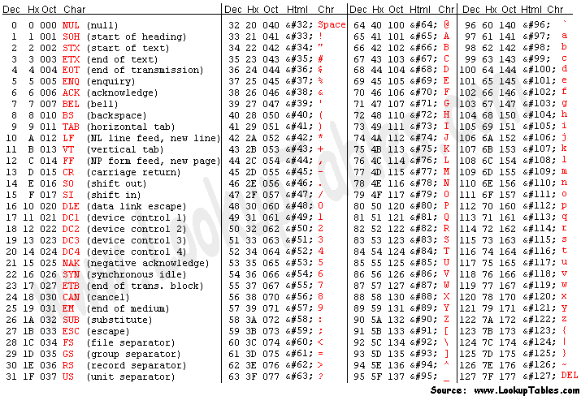

[comment1]: id "rgb(44,44,110)四级标题"
[comment2]: id "rgb(110,110,0)三级标题"
[comment3]: id "rgb(0,110,110)二级标题"
[comment4]: id "rgb(110,0,110)一级标题"

<h1 align="center"><span style="color: rgb(110,0,110)">Markdown</span></h1>

<h2 align="center"><span style="color:rgb(0,110,110)">Table of contents</span></h2>

* [1. 标题](#1-标题)
* [2. 链接和图片](#2-链接和图片)
* [3. 代码块](#3-代码块)
* [4. 表格](#4-表格)
* [5. 列表 粗体 斜体 缩进](#5-列表-粗体-斜体-缩进)
* [6. html的一些拓展](#6html的一些拓展)
* [7. github中使用的目录](#7-github中使用的目录)

### 1. 标题

``` markdown
# 一级标题
## 二级标题
### 三级标题
#### 四级标题
##### 五级标题
###### 六级标题

一级标题 Underline
==================

二级标题 Underline
------------------
```
**Like this**  <span style="color:rgb(111,111,222);background:rgb(222,222,,111)">段落的文字用'  '两个空格换行</span>
# 一级标题
## 二级标题
### 三级标题
#### 四级标题
##### 五级标题
###### 六级标题

一级标题 Underline
==================

二级标题 Underline
------------------

### 2. 链接和图片
**链接**

``` markdown
[inline-style link](https://google.com/ncr)
[inline-style link with a title](https://google.com/ncr "A example")
[refer style link][refer id]
[like to a file](./a/example)

[refer id]:https://google.com/ncr "A example"
```
*Final like this*  
[inline-style link](https://google.com/ncr)  
[inline-style link with a title](https://google.com/ncr "A example")  
[refer style link][refer id]  
[like to a file](./a/example)  

[refer id]:https://google.com/ncr "A example"


**图片**
``` markdown

![refer style][referid]

[referid]:https://google.com/logo.png "title"
```
*Final like this*  
  
![refer style][referid]  

[referid]:./img/google-logo.png "title"

### 3. 代码块

**大段的**
``` markdown
``` C
#include<stdio.h>

int main()
{
	printf("Hello is a markdown example\n");
	return 0;
}
```  				'
```

**Fianl is this**
``` C
#include<stdio.h>

int main()
{
	printf("Hello is a markdown example\n");
	return 0;
}
```

**小段的**
``` markdown
This is a example `echo "Hello!`.
```
**Final is this**  
This is a example `echo "Hello!`.

### 4. 表格

``` markdown
|中文|English|Latin|
|:--:|------:|-----|
|车|car|currus|
|房|room|domus|
|钱|money|pecunia|
```
**Final is this**

|中文|English|Latin|
|:--:|------:|-----|
|车|car|currus|
|房|room|domus|
|钱|money|pecunia|

### 5. 列表 粗体 斜体 缩进

``` markdown
* list1
  * sublist1
+ list2
* list3
+ list4

*Bold1*  _Bold2_  

**Italic1** __Italic2__

> Indent1
>> Indent2
> Indent11
```
**Final is this**  

* list1
  * sublist1
+ list2
* list3
+ list4

*Bold1*  _Bold2_  

**Italic1** __Italic2__

> Indent1
>> Indent2

> Indent11

### 6. HTML的一些拓展

> 创建简单的目录  

``` markdonw
[comment1]: id "rgb(44,44,110)四级标题"
[comment2]: id "rgb(110,110,0)三级标题"
[comment3]: id "rgb(0,110,110)二级标题"
[comment4]: id "rgb(110,0,110)一级标题"

<h1 align="center"><span style="color: rgb(110,0,110)">Markdown</span></h1>

<h2 align="center"><span style="color:rgb(0,110,110)">Table of contents</span></h2>

* [1. 标题](#1)
* [2. 链接和图片](#2)
* [3. 代码块](#3)
* [4. 表格](#4)
* [5. 列表 粗体 斜体 缩进](#5)
* [6. HTML的一些拓展](#6)

<h3 name="1"><span style="color:rgb(110,110,0)">1. 标题</span><h3>
```
> Ascii Table  


``` markdown
&#123;&#124;&#125;
```
**Final is this**  
&#123;&#124;&#125;

### 7. GitHub中使用的目录

> 简单示例

``` markdown
* [1. 标题](#1-标题)
* [2. 链接和图片](#2-链接和图片)
* [3. 代码块](#3-代码块)
* [4. 表格](#4-表格)
* [5. 列表 粗体 斜体 缩进](#5-列表-粗体-斜体-缩进)
* [6. HTML的一些拓展](#6html的一些拓展)
* [7. github中使用的目录](#7-github中使用的目录)

### 1. 标题

### 2. 链接和图片

......

### 7. GitHub中使用的目录
```

**注意事项:**

+ 标题出现的大写字母在链接中使用对应的小写字母代替
+ 各级标题中出现的空格在链接中使用`-`代替
+ 忽略标点符号
